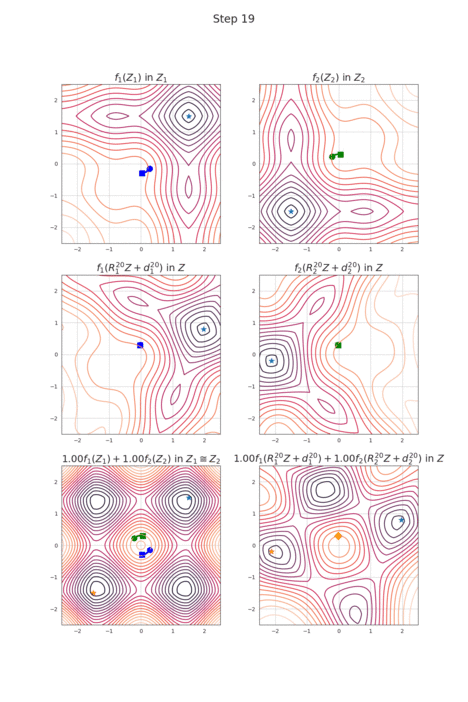

# RotoGrad


[](https://rotograd.readthedocs.io/en/stable/index.html)
[](https://pypi.org/project/rotograd/)
[](https://arxiv.org/abs/2103.02631)
[](https://github.com/adrianjav/rotograd/blob/main/LICENSE)

> A library for dynamic gradient homogenization for multitask learning in Pytorch

## Installation

Installing this library is as simple as running in your terminal
```bash
pip install rotograd
```

The code has been tested in Pytorch 1.7.0, yet it should work on most versions. Feel free to open an issue
if that were not the case.

## Overview

This is the official Pytorch implementation of RotoGrad, an algorithm to reduce the negative transfer due 
to gradient conflict with respect to the shared parameters when different tasks of a multitask learning
system fight for the shared resources.

Let's say you have a hard-parameter sharing architecture with a `backbone` model shared across tasks, and 
two different tasks you want to solve. These tasks take the output of the backbone `z = backbone(x)` and fed
it to a task-specific model (`head1` and `head2`) to obtain the predictions of their tasks, that is,
`y1 = head1(z)` and `y2 = head2(z)`.

Then you can simply use RotateOnly, RotoGrad. or RotoGradNorm (RotateOnly + GradNorm) by putting all parts together in a single model.

```python
from rotograd import RotoGrad
model = RotoGrad(backbone, [head1, head2], size_z, normalize_losses=True)
```

where you can recover the backbone and i-th head simply calling `model.backbone` and `model.heads[i]`. Even
more, you can obtain the end-to-end model for a single task (that is, backbone + head), by typing `model[i]`.

As discussed in the paper, it is advisable to have a smaller learning rate for the parameters of RotoGrad
and GradNorm. This is as simple as doing:

```python
optim_model = nn.Adam({'params': m.parameters() for m in [backbone, head1, head2]}, lr=learning_rate_model)
optim_rotograd = nn.Adam({'params': model.parameters()}, lr=learning_rate_rotograd)
```

Finally, we can train the model on all tasks using a simple step function:
```python
import rotograd

def step(x, y1, y2):
    model.train()
    
    optim_model.zero_grad()
    optim_rotograd.zero_grad()

    with rotograd.cached():  # Speeds-up computations by caching Rotograd's parameters
        pred1, pred2 = model(x)
        
        loss1 = loss_task1(pred1, y1)
        loss2 = loss_task2(pred2, y2)
        
        model.backward([loss1, loss2])
    
    optim_model.step()
    optim_rotograd.step()
        
    return loss1, loss2
```

## Example

You can find a working example in the folder `example`. However, it requires some other dependencies to run (e.g., 
ignite and seaborn). The example shows how to use RotoGrad on one of the regression problems from the manuscript.



## Citing

Consider citing the following paper if you use RotoGrad:

```bibtex
@inproceedings{javaloy2022rotograd,
   title={RotoGrad: Gradient Homogenization in Multitask Learning},
   author={Adri{\'a}n Javaloy and Isabel Valera},
   booktitle={International Conference on Learning Representations},
   year={2022},
   url={https://openreview.net/forum?id=T8wHz4rnuGL}
}
```
